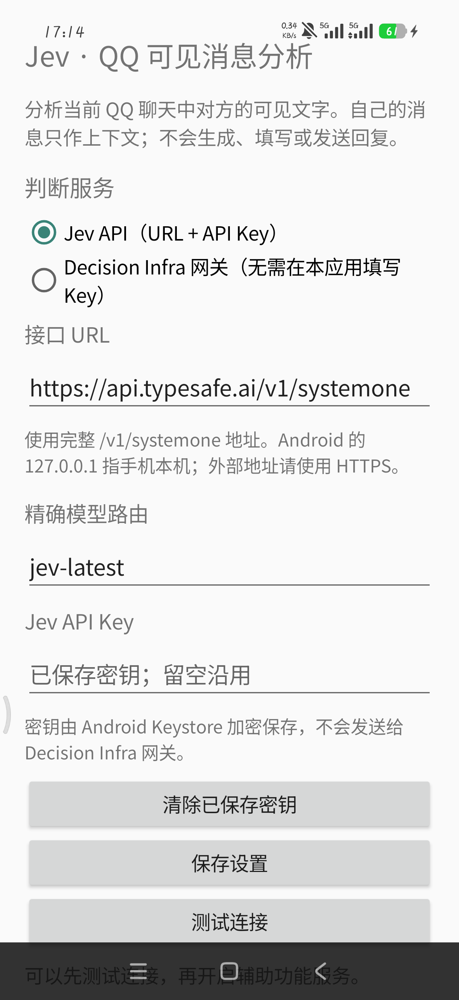

<p align="center"></p>

<h1 align="center">Jev · QQ 可见消息分析</h1>

<p align="center">
  <strong>看懂当前聊天，不替你回复。</strong><br>
  在 macOS 与 Android QQ 的当前聊天页，逐条分析屏幕上可见的对方文字。
</p>

<p align="center">
  <a href="https://github.com/hufaei/jev-qq-analyst/releases/latest"></a>
  <a href="https://github.com/hufaei/jev-qq-analyst/actions/workflows/ci.yml"></a>
  
  
  <a href="LICENSE"></a>
</p>

**下载 Android APK：** [最新版安装包](https://github.com/hufaei/jev-qq-analyst/releases/latest/download/jev-qq-analyst-android.apk) · [所有版本与 SHA-256 校验值](https://github.com/hufaei/jev-qq-analyst/releases) · [Android 详细说明](android/README.md)

## 一眼看懂

| | Android | macOS |
| --- | --- | --- |
| 读取方式 | QQ 前台聊天页的无障碍节点 | QQ 前台窗口的辅助功能节点 |
| 判断服务 | 用户填写的 Jev 兼容 HTTPS URL 与 API Key，或本机 Decision Infra | 本机 Decision Infra，精确路由 `jev-latest` |
| 展示 | 可拖动、缩放、折叠的半透明悬浮面板 | QQ 旁的悬浮窗 |
| 安装要求 | Android 8.0+（APK 的最低系统版本） | Apple Silicon、macOS 13+、Python 3.12 |

对方的文字各有一张分析卡，显示**意图、情绪、回复风险、是否值得回复、意图候选和下一步策略**。自己的消息只作上下文；可识别的图片、表情和文件只显示类型占位。分析只针对当前已加载、屏幕上可见的内容。

> [!NOTE]
> Android 真机已在 **Xiaomi 17 Pro · Android 16（API 36）· HyperOS 3.0.319.0.WBLCNXM · QQ 9.3.55** 上验证：可识别普通与长文本对方消息，并完成 Jev 分析。Android 8.0+ 是安装下限；其他手机、系统和 QQ 版本的识别效果仍需实测。

<p align="center">
  <a href="docs/images/android-settings-xiaomi17pro.png"></a><br>
  <sub>Android 设置页实机截图 · 点击查看原图</sub>
</p>

## Android 快速开始

1. 在手机上安装 [Release APK](https://github.com/hufaei/jev-qq-analyst/releases/latest/download/jev-qq-analyst-android.apk)。**正常使用不需要连接 Mac 或 USB。**
2. 打开 **Jev · QQ 可见消息分析**，填写 Jev 兼容的完整 HTTPS `/v1/systemone` URL、模型路由和对应 API Key；点“保存设置”及“测试连接”。
3. 在系统“辅助功能”里开启 **Jev · QQ 可见消息分析**，然后进入一个 QQ 聊天页。面板只在 QQ 位于前台时出现。

需要从源码构建、连接本机 Decision Infra 或排查无障碍节点时，参见 [Android 使用说明](android/README.md)。此前自行安装的 debug APK 与 Release APK 签名不同；切换到 Release 版前需要卸载 debug 版并重新填写设置。

若另一款手机上的 QQ 提示“会话标题未识别”或没有可见消息，v0.6.1 起可在设置页手动采集并导出[不含聊天文字的节点报告](android/README.md#不连接电脑导出兼容性诊断)，无需连接电脑。

v0.6.2 根据 iQOO V2520A 上 QQ 9.3.65 的节点报告补充了会话标题识别；该组合还需真机复测。

> [!IMPORTANT]
> 应用不截图、不 OCR、不读取 QQ 数据库、不注入、不 hook，也不生成、复制、填入或发送回复。Android 直连 Jev 时，API Key 由 Android Keystore 在手机本地加密保存；macOS 端只连接 Decision Infra。完整数据流向见 [隐私说明](PRIVACY.md)。

## macOS 快速开始

要求：Apple Silicon Mac、macOS 13+、已登录的 QQ，以及本机运行的 [Decision Infra](https://github.com/hufaei/decision-infra)。本项目使用 Python 3.12 和 `uv`；`start.command` 会在缺少 `uv` 时尝试安装。启动 infra 需要 Node.js 22+ 和 pnpm 12.5.1。

1. 在本机 Decision Infra 项目中配置 Provider 并启动网关：

```bash
cd /你的路径/decision-infra
pnpm install
# TYPESAFE_API_KEY 只配置在这个项目的 .env 或启动环境中
pnpm gateway
```

2. 另开终端确认网关在线：

```bash
curl http://127.0.0.1:8080/healthz
```

应返回 `{"status":"ok"}`。这只证明网关在线；`jev-latest` 是否可用仍由下一步的真实决策验证。

3. 打开“系统设置 → 隐私与安全性 → 辅助功能”，给运行程序的终端或 `jev-jarvis.app` 授权。`jev-jarvis.app` 是当前打包脚本仍使用的兼容名称。
4. 保持 QQ 主窗口打开并切到需要分析的聊天。
5. 在本项目启动悬浮窗：

```bash
./start.command
```

只检查 QQ 读取链路，不启动模型：

```bash
uv run python src/qq_ax.py
```

该命令只输出窗口尺寸、消息数量、收发方向和耗时，不打印聊天标题、昵称或正文。

## 在页面上验收

先双击 `preview.command`，或在终端运行 `./preview.command`。它只显示合成消息，不读取 QQ、不请求模型；红色窗口按钮退出预览。

验收真实读取与分析：

1. 打开 QQ，并让另一个 QQ 账号发来“这个事情今天能搞定吗？”。
2. 保持该聊天位于前台一两秒。
3. 悬浮窗按 QQ 可视区顺序显示消息：对方的文字是完整分析卡，自己的文字是较窄的上下文条。可识别的图片、表情和文件只显示“【图片】”“【表情】”“【文件】”等占位条，不调用 Jev；只有时间的行不显示。分析卡先显示原话、主要判断和“回复风险”分数；“是否值得回复”显示此刻回复的判断值，行为和需要以轻量标签呈现；“下一步”最多显示三条建议。
4. 状态显示 `对方 2 条 · 已分析 2 条`（数字随可视区变化）；实际模型路由可在启动日志中核实，预览模式不做模型调用。
5. 如果网关返回 `404`，说明它没有注册 `jev-latest`，通常是 Decision Infra 进程没有拿到 `TYPESAFE_API_KEY`。卡片会显示分析失败，可在日志中查看错误类型。
6. 如果网关返回 `503`，说明它背后的 Provider 不可用。应用不会改用其他模型。
7. 切到浏览器后面板应隐藏；回到 QQ 后重新读取当前可见消息。
8. 同一屏里放两条连续的对方文字和一条自己的回复：应依次出现两张分析卡、一条“我 · 上下文”条；状态只计数两条可分析的对方文字。媒体占位保持原顺序，但不计入分析条数。滑到别处再滑回来，已经分析过的文字应从进程内缓存回显；新看到的对方历史文字会分析。收发方向取消息行自身的发送者容器及其左右位置；即使右侧发送者显示昵称，也应识别为自己的消息。遇到很长、横跨窗口的消息时，要实测方向是否仍正确。
9. 用 QQ 的“引用/回复消息”功能分别让自己和对方发一条带引用的新消息，尤其可引用一条含“我”或对方名字的话：收发方向应取新消息行的发送者，不受引用中的名字影响。如果 QQ 辅助功能树标出了引用容器，卡片标题会显示“引用：…”，原话区只显示新写内容。若标题没有“引用”，不要把分析结果当成已正确区分引用；请记录 QQ 版本和页面表现供适配。
10. 看一条无需立即回复的消息时，检查“是否值得回复”的判断值和“先不回复，留点空间”；对方明确提问时，检查“下一步”的三条策略是否各占一行、按适配分排序。颜色不代替数字。这里是策略判断，不是生成待发送的回复。

页面底部不应出现候选回复、“复制”“填入”或“发送”按钮。

## 能看到什么

QQ 辅助功能树提供以下输入：

| 数据 | 说明 |
|---|---|
| 当前聊天标题 | 从消息区域上方的 AX 标题节点读取 |
| 可见消息正文 | 读取“消息列表”容器下的 `AXStaticText` |
| 表情与附件 | 文字中的 Unicode 表情随正文读取；可识别的图片、贴图和文件仅在悬浮窗显示固定类型占位，不展示媒体内容或文件名，也不进入分析 |
| 收发方向 | 读取消息行自身的发送者容器名称及左右位置，不从引用或整条消息文字中搜名字；右侧按自己、左侧按对方处理。证据不足时不分析 |
| 被引用的文字 | 仅当 QQ 的 AX 节点明确标注引用/回复容器时，与新写正文分开；引用只作背景 |
| 消息顺序和位置 | 用于上下文、去重和可选检测框 |

Jev 返回以下分析结果：

| 字段 | 含义 |
|---|---|
| `intent` | 当前话语的主要意图；覆盖日常提问、告知、求助、邀约、倾诉、道歉、道谢和催回复等 17 类，边界不明确时保留“闲聊” |
| `confidence` | 最终意图的置信度 |
| `intent_probs` / `intent_ranking` | 所有意图的概率分布及排名前三的候选 |
| `risk` | 此刻直接回复的 0–9 风险期望值；界面显示为“回复风险 N/9” |
| `risk_probs` | 十个风险等级的完整概率分布 |
| `behavior` / `emotion` / `need` | 对话行为、文字可支持的情绪、当前可能需要的回应；把握低时不强行显示肯定判断 |
| `signals` | 隐含请求、催促感、明确边界是概率信号，只显示超过阈值的提示；不是长期关系结论 |
| `reply_probability` | Jev `noul` 对“此刻回复是否比先等等更值得、更有助于对话”的判断值；界面显示百分比，并非实际结果的统计概率。低于 40% 时只建议暂不回复，高于 60% 时不推荐沉默，中间区间保持开放 |
| `action_rankings` / `actions` | Jev 对 12 种中文行动策略逐项使用 `score` 的 0–4 适配度，显示前三名；这些是策略，不是生成的回复文本，也不是概率 |
| `backend` | Decision Infra 实际返回的精确路由，如 `infra/jev-latest` |

示例：

```json
{
  "intent": "催进度",
  "confidence": 0.87,
  "risk": 4.2,
  "behavior": "催促",
  "emotion": "着急",
  "need": "明确时间",
  "reply_probability": 0.84,
  "intent_ranking": [{"label": "催进度", "probability": 0.87}, {"label": "问进度", "probability": 0.13}],
  "action_rankings": [{"id": "schedule", "label": "说清楚什么时候能处理", "score": 3.8}],
  "actions": ["说清楚什么时候能处理"],
  "backend": "infra/jev-latest"
}
```

## 配置 Decision Infra

打开悬浮窗里的“模型设置”，界面只配置 Decision Infra 网关地址和精确模型路由。也可以按 [`.env.example`](.env.example) 编辑 `~/.config/jev-jarvis/env`。这个路径与日志 `~/Library/Logs/jev-jarvis.log` 沿用旧应用名，重命名仓库不会迁移它们：

```bash
export DECISION_INFRA_BASE_URL="http://127.0.0.1:8080"
export DECISION_INFRA_MODEL="jev-latest"
```

不要把 `TYPESAFE_API_KEY` 放进 QQ 应用配置。它只属于 Decision Infra 的 `.env` 或启动环境。

当前 HUD 不创建回复生成器、不使用 OpenAI/Anthropic 配置、不启动候选生成或候选排序线程，也不显示“复制”“填入”按钮。`DECISION_INFRA_MODEL` 是精确路由；不存在时直接报错，不自动换模型。

## 工作原理

```text
QQ 主进程 com.tencent.qq
  → AXFocusedWindow / AXMainWindow
  → 递归穿过 AXGroup
  → AXWebArea（/main/message）
  → “消息列表”
  → 当前可见的文字消息与媒体类型占位（跳过时间行）
  → Decision Infra /v1/systemone
  → jev-latest 多问题结构化判断
  → macOS 悬浮窗
```

QQ 的 Electron 辅助功能树有时不会出现在 `AXWindows`。适配器会启用 `AXManualAccessibility`，并优先从 `AXFocusedWindow`、`AXMainWindow` 开始遍历；不会在 `AXGroup` 或 `AXWebArea` 停止。

## 已知限制

- 只读取当前已经加载、当前可见的消息；不会自动滚动，也不再只保留最后 12 条可见行。每条可见对方消息单独判断；自己的消息只用作上下文。进程内最多保留每个会话最近 32 条已见消息、24 个会话和 128 个判断缓存；退出即清空。一次判断最多使用目标消息之前的 8 条已见消息（双方都算），拼接后最多 2000 个 Unicode 字符，包括昵称和换行；不是 8 个来回，也不会补齐没读到的历史。
- Unicode 文字表情随正文读取；带图片或贴图节点的消息整行只显示类型占位，不分析，即使同行还有文字。文件等附件只在 QQ 辅助功能树能明确识别类型时标注，无法确定的附件使用通用占位。QQ 若把媒体内容伪装成普通文字节点且不提供类型线索，仍可能需要按该版本的辅助功能树适配。
- 滑动到此前没见过的对方历史消息也会分析；滑回已经分析过的消息会用缓存回显。QQ AX 当前没有可依赖的稳定消息 ID；缓存键由会话、发送者、正文、引用文字和上一条对方正文拼成，不是真正唯一标识。完全相同的短句在少数情况下可能共用缓存判断；菜单“立即重新分析”可清除此会话的判断缓存。
- 情绪、需求、言外之意都是基于文字的推断；不输出“亲密度”“权力距离”“情感投资”等长期关系定论。
- 居中时间戳和系统提示会被过滤；发送者容器的左右位置用于识别收发方向，避免右侧昵称被误当成对方。容器位置缺失时才参考头像或明显的气泡位置；方向仍不明确则不触发分析。
- 引用消息若没有明确的 AX 引用容器，仍可能与新写正文混在一起；此时不能保证引用分析正确。
- QQ 改版可能改变辅助功能层级，需要重新适配容器名称或路径。
- 悬浮窗只在 QQ 位于前台时显示；切到其他应用会清空旧结果。
- 消息正文和进程内最近已见上下文会发送给本机 Decision Infra；后续是否出网取决于它路由到的 Provider。`jev-latest` 会由 infra 发送到托管 Jev。

## 开发与验证

```bash
uv run python -B -m unittest discover -s tests
uv run python src/qq_ax.py
```

测试使用合成 AX 树，不读取真实聊天。真实 QQ 冒烟检查的诊断输出同样不包含消息正文。

贡献流程见 [CONTRIBUTING.md](CONTRIBUTING.md)，路径与报错速查见 [FAQ](docs/FAQ.md)，数据流向见 [PRIVACY.md](PRIVACY.md)。

关键文件：

- `src/qq_ax.py`：QQ 辅助功能树读取与消息解析。
- `src/decision_infra.py`：Decision Infra contract 客户端、精确路由和响应校验。
- `src/hud.py`：QQ 消息分析悬浮窗和前台/旧结果边界。
- `tests/test_qq_ax.py`：深层遍历、可见行、时间戳与收发方向回归。

## 许可与隐私

MIT（见 `LICENSE`）。只应在本人设备和本人账号上使用。项目不支持读取他人聊天、绕过访问控制、解密数据库或自动发送消息。
